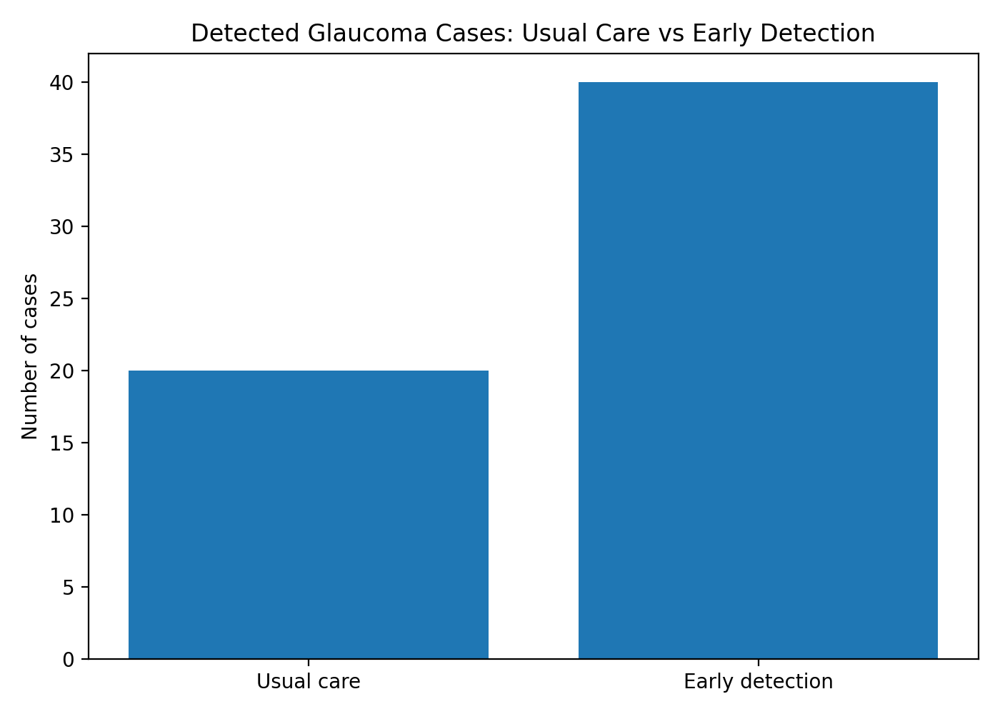
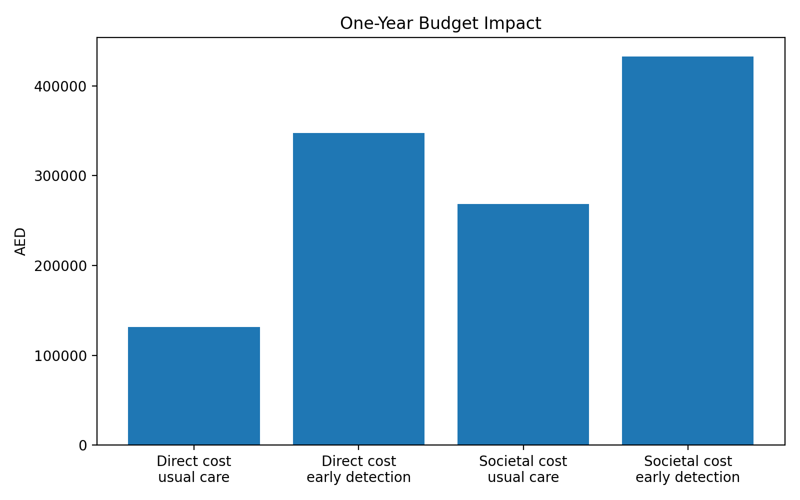
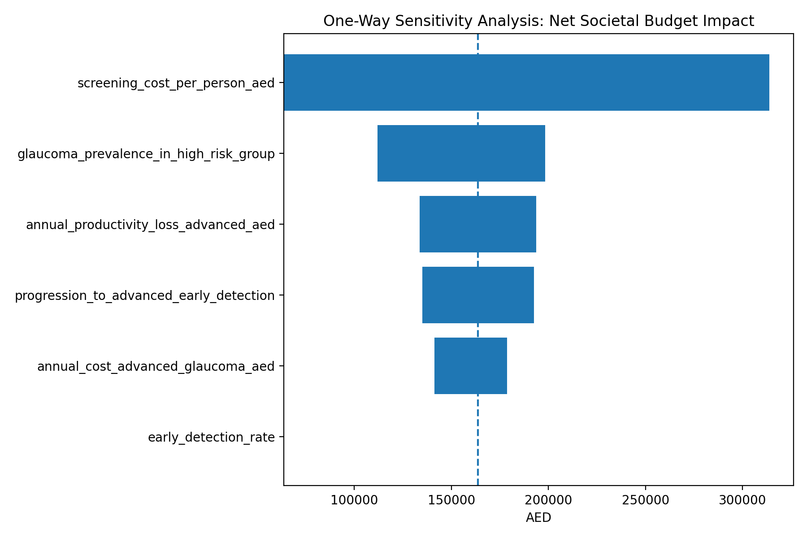

# Glaucoma Health Economics Demo  
### Early Detection • Budget Impact • Cost-Consequence Analysis • Simulated Patient-Level Data


## Summary

This repository presents a rapid health economics demo evaluating **structured early glaucoma detection** compared with **usual care** in an ophthalmology setting.

The project demonstrates how a health economist can support an ophthalmology research team by translating a clinical question into a structured, decision-focused economic model.

The demo estimates:

- expected glaucoma cases in a high-risk screened population
- additional early glaucoma cases detected
- advanced glaucoma cases potentially avoided
- direct healthcare budget impact
- productivity loss avoided
- societal cost impact
- cost per additional early case detected
- one-way sensitivity analysis

> **Important:** This project uses simulated data only. It does not contain real patient data and does not claim access to any specific internal hospital system.

---

## Why glaucoma?

Glaucoma is a chronic progressive eye disease where delayed diagnosis may lead to irreversible visual impairment. From a health economics perspective, glaucoma is important because disease progression can affect:

- ophthalmology service utilization
- long-term treatment intensity
- medication and procedure costs
- patient independence
- productivity
- caregiver burden
- quality of life

This demo focuses on the economic question:

> **Can structured early detection improve case identification and reduce downstream burden compared with usual care?**

---

## Research question

**What is the potential economic value of structured early glaucoma detection compared with usual care in an ophthalmology clinic?**

---

## Model overview

The model compares two pathways:

| Pathway | Description |
|---|---|
| Usual care | Glaucoma is detected opportunistically or later in the care pathway |
| Early detection | Higher-risk patients receive structured case-finding/screening using ophthalmology assessment inputs |

The model uses a one-year time horizon for the base case. This is suitable for a rapid budget impact demo, but it does not fully capture long-term glaucoma progression. A future 5–10 year model would better estimate long-term cost-effectiveness.

---

## Repository structure

```text
glaucoma-health-econ-demo/
├── data/
│   ├── glaucoma_demo_patients.csv
│   └── data_dictionary.md
├── docs/
│   ├── crf_template.md
│   ├── future_real_world_data_plan.md
│   └── methods.md
├── notebooks/
│   └── glaucoma_health_econ_demo.ipynb
├── outputs/
│   ├── base_case_results.csv
│   ├── model_summary.txt
│   ├── sensitivity_one_way.csv
│   └── charts/
│       ├── budget_impact.png
│       ├── detection_comparison.png
│       └── sensitivity_tornado.png
├── src/
│   ├── generate_demo_data.py
│   ├── run_model.py
│   └── sensitivity_analysis.py
├── requirements.txt
├── LICENSE
└── README.md
```

---

## Simulated data

The dataset contains simulated patient-level glaucoma-related variables.

| Category | Variables |
|---|---|
| Demographics | age, gender |
| Risk factors | family history, diabetes, hypertension |
| Ophthalmology inputs | intraocular pressure, OCT result, visual field result |
| Clinical classification | glaucoma diagnosis, disease stage, management plan |
| Economic variables | annual direct cost, estimated productivity loss |

The dataset is provided only to demonstrate structure, reproducibility, and modelling logic.

---

## Base-case assumptions

| Input | Base-case value |
|---|---:|
| Target population screened | 1,000 |
| Screening cost per person | 250 AED |
| Glaucoma prevalence in high-risk group | 5% |
| Detection rate with usual care | 40% |
| Detection rate with early detection | 80% |
| Progression to advanced disease, usual care | 25% |
| Progression to advanced disease, early detection | 10% |
| Annual early glaucoma management cost | 1,500 AED |
| Annual advanced glaucoma management cost | 6,000 AED |

All values are illustrative and should be replaced with local, approved, de-identified data in a real-world research study.

---

## Base-case results

| Result | Value |
|---|---:|
| Expected glaucoma cases | 50 |
| Detected cases with usual care | 20 |
| Detected cases with early detection | 40 |
| Additional early cases detected | 20 |
| Advanced cases avoided | 7.5 |
| Screening program cost | 250,000 AED |
| Incremental direct budget impact | 216,250 AED |
| Productivity loss avoided | 52,500 AED |
| Net societal budget impact | 163,750 AED |
| Cost per additional early case detected | 12,500 AED |

---

## Visual outputs

### 1. Detected glaucoma cases: usual care vs early detection



This chart shows that structured early detection identifies more glaucoma cases earlier compared with usual care in the simulated high-risk cohort.

---

### 2. One-year budget impact



This chart compares direct healthcare costs and broader societal costs.

In the one-year model, early detection has higher upfront cost because the screening pathway requires additional investment. However, early detection reduces advanced cases and productivity loss. A longer-term model may better capture downstream savings from avoided disease progression.

---

### 3. One-way sensitivity analysis



The sensitivity analysis shows which assumptions have the largest impact on net societal budget impact. This is important because rapid demo models depend heavily on assumptions such as screening cost, prevalence, detection rate, progression risk, and advanced disease cost.

---

## Interpretation of direct and societal costs

The model reports both **direct healthcare costs** and **societal costs**.

### Direct healthcare cost

Direct healthcare cost represents the cost from the healthcare provider or payer perspective. In this demo, it includes:

- glaucoma screening
- ophthalmology consultation
- OCT
- visual field testing
- glaucoma medication
- laser or surgery if needed
- follow-up visits

### Societal cost

Societal cost represents the broader economic burden beyond hospital spending.

In this demo:

```text
Societal cost = direct healthcare cost + productivity loss
```

Productivity loss may include:

- missed work
- reduced ability to work
- caregiver time
- reduced independence due to visual impairment

This is important in glaucoma because advanced disease can affect not only clinical outcomes, but also daily functioning, independence, caregiver burden, and economic productivity.

### Interpretation of the one-year chart

The one-year chart should not be interpreted as a final cost-effectiveness conclusion. It shows short-term budget impact and the trade-off between upfront screening investment and potential downstream benefits.

A longer-term model, for example over 5–10 years, could better capture whether early detection prevents disease progression, reduces advanced glaucoma management costs, and improves patient and societal outcomes.

---

## Sensitivity analysis

The model includes one-way sensitivity analysis for key assumptions:

| Parameter tested | Why it matters |
|---|---|
| Screening cost | Drives upfront program investment |
| Glaucoma prevalence | Affects number of cases detected |
| Early detection rate | Determines diagnostic yield |
| Progression to advanced disease | Influences avoided advanced cases |
| Advanced glaucoma cost | Drives long-term economic burden |
| Productivity loss from advanced glaucoma | Affects societal cost impact |

This helps identify which assumptions should be prioritized for validation in a real-world study.

---

## Real-world data plan

In a real hospital research setting, assumptions would be replaced with approved, de-identified hospital clinical data sources, including:

- ophthalmology clinic records
- OCT systems
- visual field systems
- pharmacy data
- billing / finance data
- patient-reported outcomes, if available

Real-world use would require:

- IRB / ethics approval
- data access approval
- data governance clearance
- de-identification
- clinician validation
- coding validation where ICD-based variables are used
- secure storage and controlled access
- reproducible analysis scripts

---

## Suggested real-world variables

| Domain | Example variables |
|---|---|
| Patient demographics | age, gender, nationality group |
| Risk factors | family history, diabetes, hypertension, steroid use |
| Symptoms | blurred vision, peripheral vision loss, halos, eye pain, headache, nausea/vomiting, red eye |
| Diagnosis | glaucoma suspect, confirmed glaucoma, glaucoma type |
| ICD/coding | ICD code group, diagnosis code system, laterality, stage coding |
| Ophthalmology tests | IOP, OCT result, RNFL thickness, visual field result |
| Disease severity | mild, moderate, severe, indeterminate |
| Treatment | drops, laser, surgery, monitoring |
| Resource use | visits, tests, procedures, medications |
| Costs | consultation, testing, medication, procedure, surgery costs |
| Patient outcomes | quality of life, productivity loss, caregiver support |

---

## How to run the project

```bash
pip install -r requirements.txt
python src/generate_demo_data.py
python src/run_model.py
python src/sensitivity_analysis.py
```

Outputs are saved in:

```text
outputs/
outputs/charts/
```

---

## What this project demonstrates

This project demonstrates the ability to:

- frame an ophthalmology research question from a health economics perspective
- create a simulated patient-level dataset
- structure research variables and a data dictionary
- design a CRF-style data collection plan
- build a reproducible budget impact model
- conduct cost-consequence analysis
- perform one-way sensitivity analysis
- communicate model outputs using tables and charts
- prepare a future real-world research plan under data governance requirements

---

## Limitations

This is a rapid demo and should not be interpreted as clinical or economic evidence.

Main limitations:

- simulated data only
- illustrative costs and probabilities
- one-year time horizon
- no QALY estimation
- no Markov disease progression model
- no real-world validation
- no patient-level clinical outcomes
- no claim of clinical effectiveness

A full study would require real-world de-identified data, longer follow-up, validated disease progression assumptions, clinical input, and potentially a cost-utility or Markov modelling approach.

---

## Future development

Potential next steps:

1. Replace assumptions with approved de-identified real-world data.
2. Add a longer-term 5–10 year disease progression model.
3. Include quality-of-life outcomes such as EQ-5D or vision-specific instruments.
4. Estimate QALYs if utility data become available.
5. Compare screening strategies by age group, risk group, or referral source.
6. Add probabilistic sensitivity analysis.
7. Prepare manuscript-ready tables and figures.

---

## Suggested CV description

**Glaucoma Early Detection Health Economics Demo**  
*Python | Simulated Data | Budget Impact Analysis | Cost-Consequence Analysis | Ophthalmology Research*

- Developed a rapid health economics demo evaluating structured early glaucoma detection compared with usual care in an ophthalmology setting.
- Created a simulated patient-level dataset including risk factors, intraocular pressure, OCT result, visual field result, disease stage, management plan, direct costs, and productivity loss.
- Built a budget impact and cost-consequence model estimating additional early cases detected, advanced cases avoided, productivity loss avoided, and cost per additional early case detected.
- Conducted one-way sensitivity analysis to evaluate the impact of screening cost, prevalence, detection rate, progression risk, and advanced glaucoma cost assumptions.
- Designed a real-world data collection plan using approved, de-identified hospital clinical data sources after IRB approval and clinician validation.

---

## Disclaimer

This project is for demonstration and portfolio purposes only. It does not contain real patient data, does not provide medical advice, and does not represent clinical or economic evidence for decision-making.
